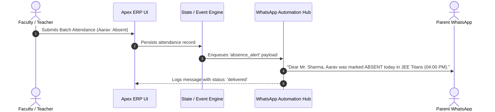

# 🎓 Apex Coaching Center ERP & WhatsApp Automation OS

[](https://nextjs.org/)
[](https://www.typescriptlang.org/)
[](https://tailwindcss.com/)
[](LICENSE)
[](#phased-master-plan-architecture)

> A modern, end-to-end Enterprise Coaching Management Platform and WhatsApp Automation Operating System built with **Next.js 14**, **TypeScript**, **Tailwind CSS**, and **jsPDF**. Designed to eliminate paper registers, Excel spreadsheets, and communication chaos for coaching institutes, test-prep centers (IIT-JEE, NEET, CBSE, Foundation), and academies.

---

## 🌟 Table of Contents
- [Executive Overview & Problem-Solution Matrix](#-executive-overview--problem-solution-matrix)
- [Key Highlights & Wow Factors](#-key-highlights--wow-factors)
- [Multi-Role Persona Architecture](#-multi-role-persona-architecture)
- [Core Functional Modules](#-core-functional-modules)
- [Automated PDF Engine](#-automated-pdf-engine)
- [WhatsApp Automation Engine](#-whatsapp-automation-engine)
- [Phased Master Plan Architecture](#-phased-master-plan-architecture)
- [Tech Stack](#-tech-stack)
- [Project Directory Structure](#-project-directory-structure)
- [Getting Started & Local Setup](#-getting-started--local-setup)
- [Interactive Persona Demo Guide](#-interactive-persona-demo-guide)
- [Roadmap & Backend Production Integration](#-roadmap--backend-production-integration)

---

## 📌 Executive Overview & Problem-Solution Matrix

Running a modern coaching institute involves complex administrative tasks across student enrollments, daily attendance, parent communication, installment fee collections, test rankings, and homework distribution. 

**Apex Coaching ERP** replaces fragmented manual registers and WhatsApp groups with a unified digital command center:

| Operational Area | Legacy Pain Point (As-Is) | Apex ERP Solution (To-Be) | Business Impact |
|---|---|---|---|
| **Student Rosters & Data** | Physical paper registers & disconnected spreadsheets. High risk of data loss. | Centralized searchable student directory with batch allocation, parent details, and status filters. | **100% digitized student records** |
| **Daily Attendance** | Teachers call roll numbers on paper; absentees are forgotten or called hours later. | 1-Tap Attendance Marker with instant automated WhatsApp absence notifications to parents. | **< 30s attendance marking** |
| **Parent Communication** | Unofficial WhatsApp groups where critical messages get lost; staff spends hours on phone calls. | Automated WhatsApp Business triggers for absences, fee reminders, PDF report cards, and broadcasts. | **Zero manual calls for daily attendance** |
| **Fee Collection & Tracking** | Unrecorded cash receipts, manual follow-ups, delayed installment collections. | Installment ledger, dynamic UPI payment links, instant digital payment modal & PDF fee receipts. | **80% reduction in overdue follow-ups** |
| **Exams & Academic Reports** | Manual grading on paper; marks written in student diaries; no visual performance analytics. | Rapid marks entry grid with auto-generated branded PDF report cards with ranks, percentages, and faculty remarks. | **Instant report cards shared to parents** |
| **Parent & Student Access** | Parents constantly call front-desk asking about attendance, test scores, or dues. | Dedicated mobile-friendly Parent & Student Portals with live attendance calendars, fee payment, and homework. | **75% reduction in front-desk inquiry calls** |

---

## ✨ Key Highlights & Wow Factors

- 🚀 **1-Tap Batch Attendance Marking**: Faculty can mark whole batches present in one tap, toggle absentees with remarks, and automatically trigger instant WhatsApp alerts to parents.
- 💳 **Integrated UPI Checkout & PDF Receipts**: Parents can view pending fee installments, open the simulated UPI payment modal (GPay / PhonePe / QR Code), and immediately download official stamped PDF receipts.
- 📄 **Dynamic Client-Side PDF Engine**: Powered by `jspdf` and `jspdf-autotable` to generate branded, downloadable **Fee Receipts** and **Academic Report Cards** directly in the browser without server latency.
- 📱 **Interactive WhatsApp Automation Hub**: Real-time simulation of WhatsApp Business API dispatches (Absence notices, Fee due reminders, Payment receipts, Exam results, and Mass batch broadcasts) with live delivery logs.
- 👥 **4-in-1 Role Switcher**: Instant switching between **Admin**, **Teacher**, **Parent**, and **Student** personas to test the complete user journey in real-time.
- 📊 **Executive Business Analytics**: Visual revenue metrics, collection velocity, fee overdue breakdown, subject accuracy charts, and student retention insights built with `recharts`.
- 🗺️ **Phase 0 Discovery Blueprint & Phase 6 Launch Center**: Includes interactive solution blueprint, workflow sequence diagrams, UAT checklists, staff training guides, soft rollout schedules, and hypercare SLA policies.

---

## 🎭 Multi-Role Persona Architecture

The platform provides tailored workspaces for all institute stakeholders:

```
                          ┌────────────────────────┐
                          │   Apex Coaching ERP    │
                          │   Central Data Store   │
                          └───────────┬────────────┘
                                      │
       ┌─────────────────┬────────────┴────────────┬─────────────────┐
       ▼                 ▼                         ▼                 ▼
┌──────────────┐  ┌──────────────┐          ┌──────────────┐  ┌──────────────┐
│  👔 Admin    │  │  👩‍🏫 Teacher  │          │  👨‍👩‍👧 Parent  │  │  🎒 Student  │
│  Command     │  │  Faculty     │          │  Portal      │  │  Learning    │
│  Center      │  │  Portal      │          │  & Payments  │  │  Portal      │
└──────────────┘  └──────────────┘          └──────────────┘  └──────────────┘
```

### 1. 👔 Super Admin (Owner / Management)
- **Executive Dashboard**: KPI stat cards (total active students, enrolled batches, collected revenue, pending fees, today's attendance %).
- **Student Roster Management**: Add, edit, search, filter, view profiles, assign batches, and record payments.
- **Batch & Course Management**: Create and configure batches (JEE Titans, NEET Super-30, CBSE Centum, Foundation NTSE), set fee structures, schedules, classrooms, and assign faculty.
- **Fee Management & Invoicing**: Multi-tier installment tracking, overdue filters, 1-click WhatsApp payment reminders, and manual/UPI payment reconciliation.
- **Academics & Examination Engine**: Schedule exams, bulk marks entry, grade calculation, and rank generation.
- **WhatsApp Automation Hub**: Real-time messaging queue, template triggers, delivery status tracking, and batch broadcasts.
- **Business & Academic Analytics**: Revenue trends, fee collection status, batch-wise performance distributions.

### 2. 👩‍🏫 Faculty / Teacher Portal
- **Class Schedules**: Daily batch timetable with room allocation and timings.
- **Rapid Attendance Marker**: Quick batch roll call with present/absent/late toggles.
- **Test Marks Entry**: Grade assignments and input student scores with custom faculty remarks.
- **Homework Assignment Hub**: Post homework assignments with due dates, subject topics, and instructions.

### 3. 👨‍👩‍👧 Parent Portal
- **Child Selector**: Multi-child profile switcher for parents with more than one enrolled student.
- **Attendance Calendar**: Monthly breakdown of presence, absences, and overall attendance percentage.
- **Fee Installments & Direct UPI Pay**: Instant view of paid and pending dues, 1-click UPI checkout modal, and PDF receipt downloads.
- **Official Exam Report Cards**: View test scores, batch rank badges, subject breakdowns, and download official PDF progress cards.
- **Homework & Notices**: Track upcoming assignments and direct WhatsApp front-desk helpline.

### 4. 🎒 Student Portal
- **Upcoming Schedule & Timetable**: Real-time class timings, subjects, and assigned faculty.
- **Homework Tracker**: Pending vs completed homework assignments with due date urgency badges.
- **Digital Study Materials**: Downloadable lecture notes, PDF worksheets, and video resources.
- **Exam Performance**: Track test history, percentile trends, and teacher feedback.

---

## 💻 Core Functional Modules

### 1. Student & Batch Lifecycle
- Filter students by batch, status (`active`, `inactive`, `alumni`), or search by name, roll number, or school.
- Add student wizard with parent details, multi-batch enrollment, and automated fee calculation.
- Batch capacity tracking and occupancy meters.

### 2. 1-Tap Attendance & WhatsApp Dispatch
- Select batch and date to load student roster.
- "Mark All Present" button for rapid marking in under 30 seconds.
- Automatically creates an absence event and dispatches personalized WhatsApp notifications to parents.

### 3. Fee Invoicing, UPI Gateway & PDF Receipts
- Structured installment schedules (Term 1, Term 2, Term 3).
- Overdue tracking with visual status pills (`PAID`, `PENDING`, `OVERDUE`).
- Integrated **Simulated UPI Gateway** supporting UPI ID, Google Pay, PhonePe, Paytm, and QR Code scan.
- Generates official, tamper-evident **PDF Fee Receipts** with receipt numbers, transaction reference, fee ledger, and digital stamp.

### 4. Examinations & Academic Report Cards
- Create batch-level exams with total marks, passing marks, and exam date.
- Spreadsheet-like rapid marks entry table with automatic percentage, grade (`A+`, `A`, `B+`, `B`, `C`, `F`), and rank calculation.
- 1-Click PDF Report Card generator complete with header branding, rank badge, section score breakdown, and teacher remarks.

### 5. WhatsApp Automation Hub
- Live log feed of all automated messages triggered across the platform.
- Message categories: `absence_alert`, `fee_reminder`, `payment_receipt`, `report_card`, `broadcast`.
- Delivery status tracking: `sent`, `delivered`, `read`.
- Broadcast modal to dispatch announcements to all batches or selected groups.

---

## 📄 Automated PDF Engine

The platform features a built-in client-side document generator (`src/lib/pdf-service.ts`) built with `jspdf` and `jspdf-autotable`:

### 1. Branded Fee Receipt (`generateFeeReceiptPDF`)
- Official Header & Institute Registration Metadata
- Receipt No, Issue Date, Payment Mode (UPI/Cash/Card), and Transaction Ref
- Student details, Roll Number, Parent info, and School
- Itemized installment fee table
- Current payment amount, total fees paid to date, and remaining balance
- Verified digital seal and accounts authorization stamp

### 2. Student Progress Report Card (`generateReportCardPDF`)
- Executive Header with Student Assessment metadata
- High-visibility **Batch Rank Badge** (e.g., `Rank #1 in Batch`)
- Performance highlight grid: Scored Marks, Percentage, Batch Average, Batch Highest
- Sectional breakdown table (Core Concepts, Analytical Problems, Application MCQs)
- Faculty Observation & Action Plan section
- Sign-off fields for Head of Academics, Course Coordinator, and Parent

---

## 💬 WhatsApp Automation Engine



Supported automated message flows:
1. **Absence Notice**: Triggered immediately upon attendance submission.
2. **Fee Installment Reminder**: Personalized reminder with amount and dynamic UPI payment link.
3. **Payment Confirmation**: Instant receipt dispatch upon successful fee reconciliation.
4. **Test Report Card Dispatch**: Score summary and link to download official PDF.
5. **Batch Broadcasts**: Emergency holiday alerts, revision class schedules, or exam notifications.

---

## 🏗️ Phased Master Plan Architecture

The project was engineered following a structured **Phase 0 through Phase 6 Master Plan** (documented in [`/docs`](./docs)):

```
Phase 0 ──► Phase 1 ──► Phase 2 ──► Phase 3 ──► Phase 4 ──► Phase 5 ──► Phase 6
Blueprint   Foundation  Attendance  Academics   Portals     Analytics   Launch &
& Specs     & Fees      & WhatsApp  & Reports   (Parent/St) & Tools     Training
```

- **Phase 0: Discovery & Blueprint** — Current workflow mapping, problem-solution matrix, course hierarchy, RBAC matrix, sequence diagrams, and UI wireframe specs.
- **Phase 1: Foundation (Student, Batch & Fee Core)** — Replaced registers/Excel with centralized data models and fee ledger.
- **Phase 2: Attendance & WhatsApp Automation** — Rapid roll-call and real-time parent alert dispatcher.
- **Phase 3: Academics & Examination Engine** — Test scheduling, marks entry, and automated PDF report cards.
- **Phase 4: Parent & Student Portals** — Mobile-first dedicated experiences for dues payment, attendance calendars, and study materials.
- **Phase 5: Teacher Tools & Business Analytics** — Timetable schedules, homework management, and revenue analytics.
- **Phase 6: Polish, Training & Launch** — UAT sign-off matrix, staff video training guides, 3-stage soft rollout schedule, and 30-day hypercare SLAs.

---

## 🛠️ Tech Stack

### Frontend & Core
- **Framework**: [Next.js 14](https://nextjs.org/) (App Router, Client Components)
- **Language**: [TypeScript 5](https://www.typescriptlang.org/)
- **UI & Styling**: [Tailwind CSS 3](https://tailwindcss.com/)
- **Icons**: [Lucide React](https://lucide.dev/)

### Data Visualization & PDF Generation
- **Charts & Graphs**: [Recharts](https://recharts.org/)
- **PDF Generation**: [jsPDF](https://github.com/parallax/jsPDF) & [jspdf-autotable](https://github.com/simonbengtsson/jsPDF-AutoTable)
- **Date Utilities**: [date-fns](https://date-fns.org/)
- **CSS Utilities**: `clsx`, `tailwind-merge`

### State & Storage
- **State Management**: Custom Reactive Store with `localStorage` persistence & mock initializers.

---

## 📁 Project Directory Structure

```
coaching-management-system/
├── docs/                                # Master Plan & Solution Blueprints
│   ├── Master_Plan.md                   # Full 7-phase project roadmap
│   ├── Solution_Blueprint.md            # Comprehensive architecture & wireframes
│   ├── Phase_0_Discovery_Blueprint.md   # Phase 0 deliverables
│   ├── Phase_1_Foundation.md            # Student, batch & fee core specs
│   ├── Phase_2_Attendance_WhatsApp.md   # Attendance & WhatsApp specs
│   ├── Phase_3_Academics.md             # Test & report card specs
│   ├── Phase_4_Parent_Student_Portal.md # Dedicated portals specs
│   ├── Phase_5_Teacher_Tools_Analytics.md # Faculty tools & analytics specs
│   └── Phase_6_Polish_Launch.md         # Rollout & training specs
├── src/
│   ├── app/
│   │   ├── globals.css                  # Global Tailwind styling & animations
│   │   ├── layout.tsx                   # Root HTML layout & fonts
│   │   └── page.tsx                     # Main App Shell & Master Phase/Role Switcher
│   ├── components/
│   │   ├── discovery/
│   │   │   └── DiscoveryBlueprintView.tsx # Interactive Phase 0 Blueprint viewer
│   │   ├── erp/                         # Admin ERP Core Modules
│   │   │   ├── AcademicManagement.tsx   # Exams, marks entry & report cards
│   │   │   ├── AddBatchModal.tsx        # Batch creation modal
│   │   │   ├── AddStudentModal.tsx      # Student enrollment wizard
│   │   │   ├── AdminAnalytics.tsx       # Revenue & retention charts
│   │   │   ├── AdminDashboard.tsx       # Executive stat cards & feeds
│   │   │   ├── AttendanceManagement.tsx # 1-tap roll-call & WhatsApp trigger
│   │   │   ├── BatchManagement.tsx      # Batch rosters & capacity cards
│   │   │   ├── CreateExamModal.tsx      # Exam scheduler modal
│   │   │   ├── FeeManagement.tsx        # Fee installments & payment reminders
│   │   │   ├── MarksEntryModal.tsx      # Bulk marks & grading grid
│   │   │   ├── RecordPaymentModal.tsx   # Admin payment recording modal
│   │   │   ├── StudentManagement.tsx    # Student roster & profile management
│   │   │   ├── UpiCheckoutModal.tsx     # Simulated UPI / QR payment modal
│   │   │   └── WhatsAppAutomationHub.tsx # Message log feed & broadcast modal
│   │   ├── launch/
│   │   │   └── LaunchAndTrainingCenter.tsx # Phase 6 Launch, UAT & Training Center
│   │   └── portal/                      # Dedicated Role Portals
│   │       ├── ParentPortal.tsx         # Parent dashboard, calendar, dues & reports
│   │       ├── StudentPortal.tsx        # Student homework, schedule & materials
│   │       └── TeacherPortal.tsx        # Faculty timetable, batches & homework
│   └── lib/
│       ├── mock-data.ts                 # Preloaded demo datasets (Batches, Students, Tests)
│       ├── pdf-service.ts               # jsPDF fee receipt & report card generator
│       ├── store.ts                     # Reactive store with localStorage persistence
│       └── types.ts                     # TypeScript interfaces & domain models
├── package.json
├── tailwind.config.ts
├── tsconfig.json
└── README.md
```

---

## 🚀 Getting Started & Local Setup

### Prerequisites
- [Node.js](https://nodejs.org/) (version `18.17` or higher recommended)
- `npm`, `pnpm`, or `yarn`

### 1. Clone the Repository
```bash
git clone https://github.com/your-username/coaching-management-system.git
cd coaching-management-system
```

### 2. Install Dependencies
```bash
npm install
```

### 3. Run the Development Server
```bash
npm run dev
```

Open [http://localhost:3000](http://localhost:3000) in your browser to view the application.

### 4. Build for Production
```bash
npm run build
npm run start
```

---

## 🎮 Interactive Persona Demo Guide

The top navigation bar provides instant control over phases and roles:

1. **Phase 0: Blueprint**: Explore the original requirements, workflow sequence diagrams, and problem-solution matrix.
2. **Management ERP**: The core live application. Use the **Role** pills on the top right to switch between:
   - **Admin**: Full access to all 8 ERP tabs (Dashboard, Students, Batches, Fees, Attendance, Academics, Analytics, WhatsApp Hub).
   - **Teacher**: Faculty dashboard with assigned batches, timetable, attendance shortcut, marks entry, and homework creator.
   - **Parent**: Parent view with attendance calendar, fee installment status, instant UPI checkout modal, and PDF report cards.
   - **Student**: Student view with study materials downloads, homework submission tracking, and test analytics.
3. **Phase 6: Launch & UAT**: Review the UAT sign-off matrix, staff training curriculum, soft-rollout tracker, and 30-day hypercare support plan.
4. **Reset Demo Data**: Click the refresh button (`↺`) in the top navbar anytime to reset data to its original default state.

---

## 🔮 Roadmap & Backend Production Integration

When transitioning from the client-side prototype to production scale:

- [ ] **Database & ORM**: Connect to PostgreSQL using Prisma ORM or Drizzle ORM.
- [ ] **Authentication**: Implement NextAuth.js / Supabase Auth with Role-Based Access Control (RBAC) and JWTs.
- [ ] **WhatsApp Provider Integration**: Connect WhatsApp Business API via Twilio, Gupshup, or Meta Cloud API webhooks.
- [ ] **Payment Gateway**: Live Razorpay / Cashfree / Stripe webhooks for instant payment reconciliation and automatic receipt triggering.
- [ ] **Cloud Storage**: AWS S3 or Cloudflare R2 bucket for storing homework attachments and lecture recordings.
- [ ] **Mobile Native Wrapper**: Capacitor / React Native wrapper for Google Play Store and Apple App Store distribution.

---

## 📄 License

This project is licensed under the MIT License — see the [LICENSE](LICENSE) file for details.

---

## 🤝 Contributing

Contributions, issues, and feature requests are welcome! Feel free to check the [issues page](https://github.com/your-username/coaching-management-system/issues).

---

<div align="center">
  <sub>Built with ❤️ for modern coaching institutes and educators.</sub>
</div>
