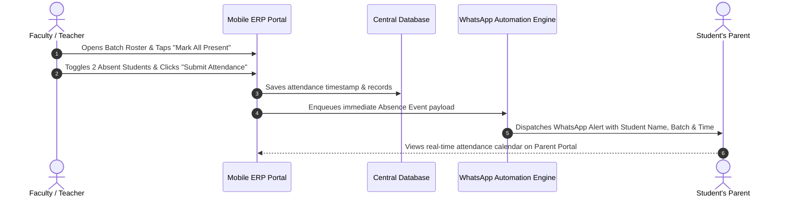
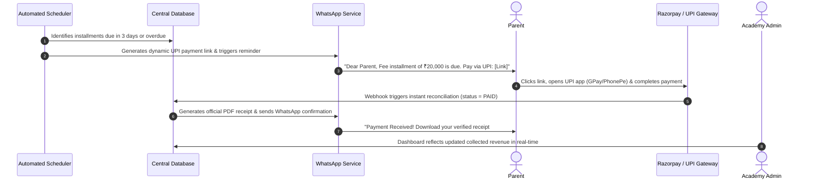

# Phase 0 Deliverable: Comprehensive Solution Blueprint & Wireframes

**Project:** Apex Coaching Center ERP & Automation Platform  
**Target Organization:** Apex Academy of Excellence (Coaching & EdTech)  
**Deliverable Status:** Final Approved Blueprint  
**Phase:** 0 — Discovery & Blueprint  

---

## 1. Executive Summary & Problem-Solution Matrix

The goal of this project is to eliminate operational overhead, administrative bottlenecks, and manual communication chaos by replacing registers, uncoordinated spreadsheets, and ad-hoc WhatsApp groups with an integrated, automated coaching management platform.

### Current Workflow Analysis vs. Target Solution

| Operational Area | Current Pain Point (As-Is) | Target Solution (To-Be) | Impact Metric |
|---|---|---|---|
| **Student Rosters & Records** | Physical paper registers and disconnected Excel sheets. High risk of data loss. | Centralized digital directory with search, filter, batch allocation, and parent links. | **100% digitized student records** |
| **Attendance Tracking** | Teachers call out roll numbers; absentees are forgotten or called manually hours later. | 1-Tap Mobile Attendance UI. System instantly flags absentees and triggers automated alerts. | **< 30 sec attendance marking** |
| **Parent Communication** | Unofficial WhatsApp groups where messages get lost; staff spends hours making individual calls. | Automated WhatsApp Business API integration for absences, exam updates, and receipts. | **Zero manual calls for daily attendance** |
| **Fee Collection & Tracking** | Unrecorded cash receipts, messy Excel formulas, awkward manual payment reminder calls. | Multi-tier installment schedules, automated payment reminder links via WhatsApp, instant digital PDF receipts. | **80% reduction in overdue follow-ups** |
| **Exams & Academic Reports** | Manual grading on paper; marks handwritten in diaries; no visual performance analytics. | Rapid marks entry grid with automated branded PDF report cards with rank and percentile graphs. | **Instant report cards sent to parents** |
| **Parent/Student Access** | Parents constantly call front-desk asking for attendance, test scores, or homework. | Dedicated Parent & Student portals with real-time attendance calendar, dues, homework, and reports. | **75% reduction in front-desk inquiry calls** |

---

## 2. End-to-End Workflow Blueprints

### 2.1 Daily Attendance & Automated WhatsApp Notification Flow



### 2.2 Automated Fee Reminder, Payment & Digital Receipt Flow



---

## 3. Entity & Structure Mapping

### 3.1 Course & Batch Hierarchy

```
Apex Academy
├── 1. JEE Advanced + Mains Integrated (Class 11 & 12)
│   ├── Batch: "JEE Adv Titans (12th)" (Cap: 35 | Fee: ₹85,000/yr | 3 days/wk)
│   └── Batch: "JEE Conquerors (11th)" (Cap: 35 | Fee: ₹80,000/yr | 3 days/wk)
├── 2. NEET Medical Entrance Masterclass (Class 11 & 12)
│   ├── Batch: "NEET Super-30 (12th)" (Cap: 30 | Fee: ₹90,000/yr | 3 days/wk)
│   └── Batch: "NEET Aspire (11th)" (Cap: 30 | Fee: ₹85,000/yr | 3 days/wk)
├── 3. CBSE Board Achievers (Class 10)
│   └── Batch: "Class 10 CBSE Centum" (Cap: 40 | Fee: ₹45,000/yr | 5 days/wk)
└── 4. Foundation & Olympiad Prep (Class 8 & 9)
    └── Batch: "Class 9 Foundation NTSE" (Cap: 25 | Fee: ₹40,000/yr | 3 days/wk)
```

### 3.2 Role-Based Access Control (RBAC) Matrix

| Feature / Module | Super Admin (Owner) | Teacher / Faculty | Parent | Student |
|---|:---:|:---:|:---:|:---:|
| **Financial Analytics & Revenue** | Full Access (CRUD) | No Access | No Access | No Access |
| **Student Roster & Enrollment** | Full Access (CRUD) | View Batch Students | View Own Child | View Self |
| **Mark Attendance** | Full Access | Mark Assigned Batches | View Only | View Only |
| **Fee Collection & Invoicing** | Full Access | No Access | Pay & Download Receipts | View Only |
| **Exam Creation & Marks Entry** | Full Access | Enter Marks for Batch | View Child Report Cards | View Scores |
| **WhatsApp Broadcast Engine** | Full Access | Trigger Class Alerts | Receive Alerts | Receive Alerts |
| **Homework & Study Material** | Full Access | Upload & Review | View Homework | View & Download |

---

## 4. Defined Success Metrics & KPIs

To ensure measurable ROI for the coaching center owner:

1. **Fee Collection Velocity**: Reduce average overdue collection cycle from **24 days to under 6 days**.
2. **Administrative Labor Savings**: Save **15+ hours/week** previously spent on manual attendance logs and follow-up phone calls.
3. **Parent Satisfaction & Retention**: Target **>95% parent engagement** on the digital portal and automated WhatsApp receipts.
4. **Audit & Leakage Prevention**: **100% digital reconciliation** for all cash, bank transfer, and UPI fee collections.

---

## 5. UI/UX Wireframe Specifications

### 5.1 Admin Command Center Wireframe (Desktop View)

```
+-----------------------------------------------------------------------------------------------+
| APEX ERP  [ Search Students / Batches (Ctrl+K) ]      [🔔 3] [ Admin Profile ▼ ] [Role: Admin]|
+-----------------------------------------------------------------------------------------------+
| [Dashboard]    |  [🎓 Active Students: 106]  [💰 Revenue: ₹24.5L]  [⏳ Dues: ₹1.15L]  [📊 Att: 94%]  |
| [Students]     |------------------------------------------------------------------------------|
| [Batches]      |  REVENUE & COLLECTION TREND          |  TODAY'S BATCH SCHEDULE               |
| [Fees & Dues]  |  [ Bar / Line Chart (Apr - Sep) ]    |  • 04:00 PM - JEE Adv Titans (Hall A) |
| [Attendance]   |  • Collections: ₹4.8L this month     |  • 04:00 PM - NEET Super-30 (Hall B)  |
| [Academics]    |  • Overdue: ₹115,000 (4 students)    |  • 06:30 PM - Class 10 CBSE (Room 102)|
| [WhatsApp Hub] |------------------------------------------------------------------------------|
| [Homework]     |  RECENT WHATSAPP AUTOMATION LOGS     |  QUICK ACTIONS                        |
| [Analytics]    |  • 04:12 PM: Absence alert -> Suresh |  [+ Enroll Student] [+ Mark Attend]   |
| [Settings]     |  • 10:30 AM: Fee reminder -> Meera   |  [+ Create Test]    [📢 Broadcast]    |
+-----------------------------------------------------------------------------------------------+
```

### 5.2 Teacher Mobile Attendance Marker Wireframe (Mobile-First View)

```
+------------------------------------------+
| ☰  Apex Faculty  [ Batch: JEE Titans ▼ ] |
| Date: 04-Sep-2026   Time: 04:15 PM       |
+------------------------------------------+
| Quick Actions:                           |
| [ ✔ Mark All Present ]  [ ↺ Reset ]      |
+------------------------------------------+
| 1. Aarav Sharma (APX-001)   [ PRESENT ]  |
| 2. Ananya Gupta (APX-004)   [ PRESENT ]  |
| 3. Diya Patel (APX-002)     [ PRESENT ]  |
| 4. Isha Reddy (APX-006)     [  ABSENT ]  |
|    └─ Note: "Fever reported by parent"   |
+------------------------------------------+
| Summary: 27 Present, 1 Absent            |
| [ 🚀 SUBMIT & DISPATCH WHATSAPP ALERTS ] |
+------------------------------------------+
```

### 5.3 Parent Portal & Dues Wireframe (Mobile View)

```
+------------------------------------------+
| APEX PARENT APP     [ Student: Aarav ▼ ] |
| Delhi Public School | Roll: APX-2026-001 |
+------------------------------------------+
| ATTENDANCE SUMMARY                       |
| [ 96% Overall ] • [ 28 Present / 1 Abs ] |
| [ View Monthly Attendance Calendar 📅 ]   |
+------------------------------------------+
| FEE STATUS                               |
| Term 1: ₹30,000 [ PAID - Receipt #0412 ] |
| Term 2: ₹25,000 [ PAID - Receipt #0714 ] |
| Term 3: ₹30,000 [ DUE ON 15-OCT-2026 ]   |
| [ ⚡ PAY NOW VIA UPI / GPAY / PHONEPE ]  |
+------------------------------------------+
| RECENT EXAM REPORT CARDS                 |
| • JEE Minor Test 04: 158/180 (Rank #2)   |
|   [ 📥 Download Official PDF Report ]    |
+------------------------------------------+
```

---

## 6. Phase Sign-Off & Progression Checklist

- [x] **Activity 1**: Current workflow mapped (Registers, Excel spreadsheets, manual WhatsApp messaging).
- [x] **Activity 2**: Batch structure, fee tiers, and role-based permissions documented.
- [x] **Activity 3**: Measurable business KPIs established (80% follow-up reduction, instant alerts).
- [x] **Activity 4**: Comprehensive Solution Blueprint with wireframe diagrams prepared.
- [ ] **Next Step**: Proceed to **Phase 1: Foundation (Student, Batch & Fee Core)** implementation.
