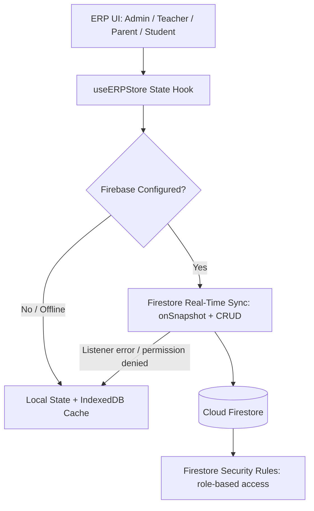

# Implementation Plan: Cloud Firestore Database Integration for ApexERP

Replace local mock storage with Google Cloud Firestore as the real-time, multi-user, persistent database backing ApexERP.

## User Review Required

> [!IMPORTANT]
> **Enable Firestore in Firebase Console**
> Project: `coachingerp-c7484`
> Go to **Build → Firestore Database → Create Database**.
> - Choose **Production mode** (we ship explicit security rules below — do not leave it in open test mode).
> - Pick a region close to your primary user base (e.g. `asia-south1` for India-based usage) — this cannot be changed later without migrating data.

> [!IMPORTANT]
> **Billing**: Firestore's free tier covers light usage, but real-time listeners on 10 collections across many concurrent users (admin/teacher/parent/student roles) can generate meaningful read volume. Confirm the Blaze (pay-as-you-go) plan is enabled before go-live, and see the Cost & Quota Guardrails section below.

---

## Architecture & Data Flow

Firestore's own offline persistence (`enableIndexedDbPersistence`) should be used as the fallback layer rather than a hand-rolled local cache — it gives queued writes and cache reads for free and avoids two divergent storage implementations.

### Collections Schema

| Collection | Key fields | Notes |
|---|---|---|
| `students` | rollNo, name, contact, batchIds[], feeBalance, guardianUid | `guardianUid` links to parent's auth UID for security rules |
| `batches` | name, course, timings, capacity, facultyId | |
| `teachers` | name, subjects[], assignedBatchIds[], authUid | `authUid` links to teacher's auth UID |
| `installments` | studentId, amount, dueDate, status, receiptUrl, upiLink | |
| `attendance` | batchId, date, records: {studentId: present/absent} | Consider one doc per batch-per-day, not per student-per-day, to bound write count |
| `exams` | batchId, name, maxMarks, passingMarks, date | |
| `marks` | examId, studentId, score, percentile, rank | Percentile/rank should be computed server-side (Cloud Function) after all marks are in, not client-side on each write |
| `homework` | batchId, title, description, dueDate, attachments[] | |
| `materials` | title, fileUrl, batchIds[], uploadedBy | Files go in Cloud Storage; Firestore stores metadata + URL only |
| `whatsapp_logs` | broadcastId, recipients[], dispatchedAt, deliveryStatus | Written by backend/Cloud Function, not client, to avoid exposing API keys |

**Indexing**: Several likely queries (attendance by batch+date range, marks by exam+student, installments by student+status) will need composite indexes. Firestore will throw a runtime error with a direct console link the first time an unindexed compound query runs — capture these during manual testing and commit `firestore.indexes.json` rather than clicking through the console link ad hoc.

---

## Proposed Changes

### 1. Database Layer & Real-Time Sync

#### [NEW] `src/lib/firestore-service.ts`
Modular, typed helpers per collection:
- `subscribeToCollection<T>(collectionName, callback, queryConstraints?)` — returns an **unsubscribe function**; callers must clean this up (see below).
- `createFirestoreDoc<T>(collectionName, docId, data)`
- `updateFirestoreDoc<T>(collectionName, docId, updates: Partial<T>)`
- `deleteFirestoreDoc(collectionName, docId)`
- `batchWrite(operations[])` — wraps Firestore's `writeBatch` for multi-document operations (e.g. marking attendance for a whole batch, or recording a payment that also updates a student's fee balance) so they're atomic instead of N separate writes.
- All functions should throw typed errors (`FirestoreServiceError`) that the store layer can catch and map to user-facing messages, instead of letting raw Firestore errors bubble to the UI.

#### [MODIFY] `src/lib/store.ts`
- Attach `onSnapshot` listeners for all 10 collections when `isFirebaseConfigured` is true, **scoped by role**: a teacher's client should query only their assigned batches (`where('assignedBatchIds', 'array-contains', batchId)`), not the whole `students` collection — both for security-rule compliance and to control read costs.
- **Listener lifecycle**: store all unsubscribe functions and tear them down on logout/unmount. Unmanaged listeners are the most common source of Firestore cost overruns and stale-data bugs in production.
- Route the 12 named actions (`addStudent`, `updateStudent`, `deleteStudent`, `addBatch`, `updateBatch`, `deleteBatch`, `markBatchAttendance`, `recordPayment`, `sendFeeReminder`, `createExam`, `saveExamMarks`, `addHomework`, `sendBroadcastMessage`) through `firestore-service.ts`.
- **Optimistic updates with rollback**: apply local state changes immediately, but on a Firestore write failure (permission denied, offline write conflict, quota error), revert the optimistic change and surface a toast/error — don't leave local state silently diverged from the cloud.
- `sendFeeReminder` and `sendBroadcastMessage` should call a **Cloud Function** (not write WhatsApp API credentials into client code) which then writes to `whatsapp_logs` on completion.

#### [NEW] `firestore.rules`
Role-based rules, not just "any authenticated user can read/write everything":
- Admins: full read/write on all collections.
- Teachers: read/write on `attendance`, `marks`, `homework`, `materials` scoped to their own `assignedBatchIds`; read-only on `students` within those batches.
- Parents/Students: read-only on their own `students` doc, their `installments`, their `attendance`/`marks` records — never other students' data.
- All writes validate shape (e.g. `request.resource.data.keys().hasAll([...])`) to reject malformed documents from a compromised or buggy client.

#### [NEW] `firestore.indexes.json`
Commit the composite indexes discovered during development (see Indexing note above) so a fresh environment deploys with working queries instead of erroring on first real query.

#### [NEW] Data Migration Script
One-time script to read existing mock/local data and write it into Firestore in the new schema, run once against a staging project before touching production data. Needed because there's currently no path described for existing local data to end up in the cloud.

### 2. Cost & Quota Guardrails
- Cap `attendance` and `marks` reads with pagination (e.g. by term/month) rather than subscribing to the full collection history.
- Debounce/batch rapid successive writes (e.g. bulk attendance marking) using `batchWrite` instead of one `onSnapshot`-triggering write per student.

---

## Verification Plan

### Automated
- `cmd.exe /c npm run build` — zero TypeScript errors.
- Firestore emulator suite (`firebase emulators:start --only firestore`) to run rules unit tests against the role-based rules above **before** deploying rules to production — a rules bug is a data-exposure bug, not just a build error.

### Manual
1. Open the ERP app at `http://localhost:3000/app`.
2. Add a batch (e.g. `Class 10 CBSE Math`) and enroll a student; confirm the document appears in Firebase Console → Firestore Database.
3. Log in as a teacher account and confirm they can see only their assigned batch's students — not the full roster (rules verification, not just functional verification).
4. Open the app in two browser windows (different roles, e.g. admin + parent) to confirm real-time sync without refresh, and confirm the parent window does **not** receive data outside its permitted scope.
5. Kill network connectivity mid-session, make an edit, restore connectivity, and confirm the queued write syncs correctly via offline persistence.
6. Confirm listeners are removed on logout (check the Firestore usage dashboard for a drop in active connections, or inspect via browser dev tools).
