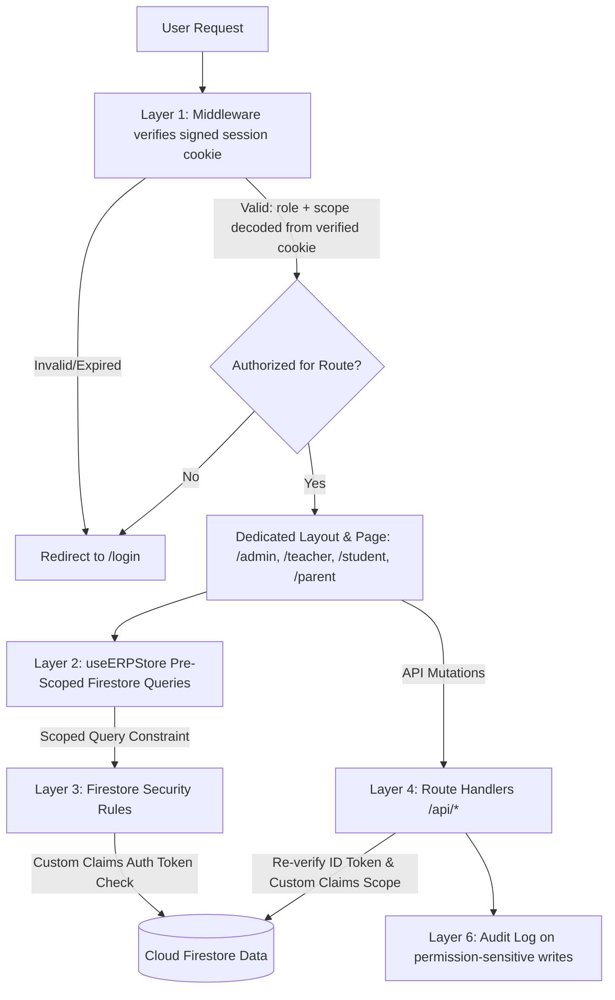

# Strict Role-Based Access Control (RBAC) Implementation Plan — v2 (Hardened)

Lock down access control across all architectural layers (Custom Claims, Session Verification,
Firestore Security Rules, Next.js Middleware, Scoped Reactive Store, Audit Logging) with
dedicated route hierarchies per persona.

**Changes from v1:** fixes a spoofable-cookie vulnerability, adds session verification suitable
for Edge/Node runtimes, adds claims-revocation on role change, adds a data-migration step for
existing users, adds Firestore `in`-query limits handling, and adds audit logging on permission
changes.

---

## User Review Required

> [!IMPORTANT]
> **Distinct Route Architecture**
> - `/admin` (Executive Dashboard, Students, Batches, Fees, Attendance, Academics, Analytics, WhatsApp Hub)
> - `/teacher` (Assigned Batches, Attendance Marking, Homework Dispatch, Academic Test Marks)
> - `/student` (Student Attendance, Homework Submissions, Study Materials, Exam Scores & Rank)
> - `/parent` (Child Profile, Real-time Attendance, Fee Dues & UPI Payment, Digital Report Cards)
>
> Navigation to `/app` or `/login` automatically resolves and routes users to their respective role dashboard.
> Admin retains the ability to view `/teacher`, `/student`, `/parent` routes in a **full-visibility override mode** (see Layer 5).

> [!IMPORTANT]
> **Session Model — Signed Session Cookie, Not a Plain Role Cookie**
> v1 proposed a plain `apex_role` cookie set by client JS. **This is spoofable** — anyone can open
> devtools and set `apex_role=admin`. Instead:
> - On login, the client sends the Firebase ID token to a server route.
> - The server (Admin SDK) verifies the ID token, then issues a **signed Firebase session cookie**
>   (`adminAuth.createSessionCookie(idToken, { expiresIn })`), httpOnly + secure + sameSite=strict.
> - Middleware verifies the **signature** of this cookie on every request — it cannot be forged
>   without the Firebase project's private key.

> [!IMPORTANT]
> **Firebase Admin SDK Custom Claims**
> - **Admin**: `{ role: "admin" }`
> - **Teacher**: `{ role: "teacher", batchIds: string[] }`
> - **Student**: `{ role: "student", studentId: string, batchId: string }`
> - **Parent**: `{ role: "parent", childIds: string[] }`
>
> Claims are embedded in the session cookie payload once issued, so middleware/rules read from a
> cryptographically verified source, not a value the client can influence after login.

---

## Architecture & Enforcement Layers



---

## Proposed Changes

### Layer 1: Firebase Admin SDK, Custom Claims & Session Issuance

#### [MODIFY] `src/lib/types.ts`
```typescript
export interface AdminClaims { role: 'admin'; }
export interface TeacherClaims { role: 'teacher'; batchIds: string[]; }
export interface StudentClaims { role: 'student'; studentId: string; batchId: string; }
export interface ParentClaims { role: 'parent'; childIds: string[]; }
export type UserClaims = AdminClaims | TeacherClaims | StudentClaims | ParentClaims;
```

#### [NEW] `src/app/api/auth/session-login/route.ts`
- Accepts the client's fresh Firebase ID token (post sign-in).
- Verifies it with `adminAuth.verifyIdToken(idToken)`.
- Issues a session cookie via `adminAuth.createSessionCookie(idToken, { expiresIn: FIVE_DAYS })`.
- Sets it as `httpOnly`, `secure`, `sameSite: 'strict'`. **No role/claims are ever set by client JS.**

#### [NEW] `src/app/api/auth/session-logout/route.ts`
- Clears the session cookie server-side.

#### [NEW] `src/app/api/admin/set-claims/route.ts`
- Verifies caller's session cookie has `role === 'admin'` (server-side, via Admin SDK).
- Validates the target role payload against a schema (reject malformed/oversized `batchIds`/`childIds`).
- Sets custom claims via `adminAuth.setCustomUserClaims(targetUid, claims)`.
- **Calls `adminAuth.revokeRefreshTokens(targetUid)`** so the affected user is forced to
  re-authenticate and cannot keep operating on stale claims.
- Writes an entry to `audit_logs` collection: `{ actorUid, targetUid, oldClaims, newClaims, timestamp }` (see Layer 6).
- Updates Firestore `user_roles/{uid}` doc as a denormalized backup used only for display, never for security decisions.

#### [MODIFY] `src/lib/auth-context.tsx`
- On auth state change, call `firebaseUser.getIdTokenResult(true)` to read claims for **UI purposes only**.
- Provide `refreshClaims()` — called after any admin action that might change the current user's own role, and periodically (e.g., on focus) to pick up revocations.
- Detect `auth/id-token-revoked` errors and force sign-out + redirect to `/login` with a "session expired" message.
- Does **not** set any cookie itself — cookie issuance is entirely server-side (Layer 1 routes above).

---

### Layer 2: Firestore Security Rules

#### [MODIFY] `firestore.rules`
Add reusable helper functions first:
```
function isAdmin() { return request.auth.token.role == 'admin'; }
function isTeacherOf(batchId) {
  return request.auth.token.role == 'teacher' && batchId in request.auth.token.batchIds;
}
function isOwnStudent(studentId) {
  return request.auth.token.role == 'student' && request.auth.token.studentId == studentId;
}
function isParentOf(studentId) {
  return request.auth.token.role == 'parent' && studentId in request.auth.token.childIds;
}
```
Then per-collection rules, e.g.:
```
match /attendance/{docId} {
  allow read: if isAdmin()
    || isTeacherOf(resource.data.batchId)
    || isOwnStudent(resource.data.studentId)
    || isParentOf(resource.data.studentId);
  allow write: if isAdmin() || isTeacherOf(request.resource.data.batchId);
}
```
- **Schema audit required first**: every document in `attendance`, `homework`, `marks`,
  `materials`, `installments` must carry `batchId` and/or `studentId` fields directly on the
  document (not only inferable via a parent reference), or rules cannot evaluate them. Audit and
  backfill missing fields before deploying rules.
- **`in` operator has a 30-item limit.** If any teacher can have 30+ batches or any parent 30+
  children (unlikely but don't assume), rules using `in` will silently deny valid access. Either
  cap assignments at 30 in the UI, or restructure to per-batch/per-child subcollections that don't
  need `in`.
- **Fee/payment/`installments` and `whatsapp_logs`**: explicitly `allow read, write: if isAdmin();`
  with no teacher/student/parent branch at all — deny-by-default rather than relying on the
  absence of a matching condition (belt-and-suspenders).
- Add a Firestore Emulator test suite (`firebase emulators:exec`) with test cases for each role ×
  each collection × allowed and denied cases, run in CI before any rules deploy.

---

### Layer 3: Next.js Middleware & Route-Level Gating

#### [MODIFY] `src/middleware.ts`
- Read the **signed session cookie** (not a plain role cookie).
- Verify its signature. Since `firebase-admin` doesn't run on the Edge runtime:
  - **Option A (recommended, simpler):** run this middleware with `export const runtime = 'nodejs'` so Admin SDK's `verifySessionCookie()` can be used directly.
  - **Option B:** if Edge runtime is required, verify the JWT signature with `jose` against Google's public certs, decoding role/scope claims without a full Admin SDK call.
- On success, decode `role` (and scope) from the verified cookie payload and gate routes:
  - Block `/admin/*` unless `role === 'admin'`.
  - Block `/teacher/*` unless `role === 'teacher'` or (`role === 'admin'` in override mode).
  - Block `/student/*` unless `role === 'student'` or (`role === 'admin'` in override mode).
  - Block `/parent/*` unless `role === 'parent'` or (`role === 'admin'` in override mode).
- On invalid/expired/revoked cookie → redirect to `/login`, clearing the stale cookie.
- Redirect `/app` to the user's dashboard root based on verified role.

---

### Layer 4: Dedicated Role Dashboards & Layouts

Same as v1 — `/admin`, `/teacher`, `/student`, `/parent` each with their own `layout.tsx` +
`page.tsx`, plus `/app/page.tsx` as the router gateway. No change needed here beyond noting:

- Each layout should re-derive scope (batchIds/studentId/childIds) from `useAuth()`'s verified
  claims, not from route params, to avoid a user manually navigating to
  `/teacher?batchId=someone-elses-batch` and having the UI trust the URL.

---

### Layer 5: `useERPStore` & Query Scoping (incl. Admin Override Mode)

#### [MODIFY] `src/lib/store.ts`
- Pass role context & scope constraints to `subscribeToCollection`:
  - `teacher`: `attendance`, `homework`, `exams`, `marks` → `where('batchId', 'in', assignedBatchIds)`.
  - `student`: `marks`, `attendance` → `where('studentId', '==', studentId)`.
  - `parent`: `installments`, `marks` → `where('studentId', 'in', childIds)`.
  - `admin`: full collection subscriptions, **including when admin is viewing `/teacher`,
    `/student`, `/parent` routes** — pass an explicit `overrideScope: true` flag so admin sees the
    same UI other roles see, but without the `where()` scoping constraint applied. This must be
    driven by the *verified* `role === 'admin'` claim, never a URL parameter.
- Batch the `in` clauses in groups of ≤30 if any array exceeds Firestore's limit, and merge
  results client-side.

---

### Layer 6: Audit Logging (new)

#### [NEW] `audit_logs` Firestore collection
- Every write to `set-claims`, and every fee/payment mutation, appends
  `{ actorUid, actorRole, action, targetId, before, after, timestamp, ip? }`.
- Rules: `allow read: if isAdmin(); allow write: if false;` (writes only via Admin SDK server-side,
  never directly from client).
- Gives you a forensic trail if a permissions bug or account compromise is ever suspected.

---

## Migration Plan for Existing Users (new — required before enabling rules)

1. **Inventory**: script to list all existing Firebase Auth users and their intended role (from
   current Firestore `users`/`user_roles` data).
2. **Backfill claims**: one-time Admin SDK script setting custom claims for every existing user
   per the schema above. Log failures for manual review.
3. **Backfill document fields**: ensure every existing `attendance`/`homework`/`marks`/`installments`
   document has `batchId`/`studentId` fields populated (query + batch-update any missing).
4. **Staged rollout**: deploy Firestore rules in `allow read, write: if true` (current permissive
   state) alongside the new rules file in a **staging project first**, run the emulator test suite,
   then promote to production only after all test cases pass and backfill is verified complete.
5. **Force re-login**: after claims backfill, call `revokeRefreshTokens()` for all users so
   everyone picks up their new claims on next request rather than waiting for natural token expiry.

---

## Verification Plan

### Automated
- `npm run build` — zero TypeScript/Next.js build errors across all new routes.
- `firebase emulators:exec --only firestore "npm run test:rules"` — per-role × per-collection
  allow/deny test matrix, run in CI on every `firestore.rules` change.

### Manual Scenarios
1. **Admin Access**
   - Log in as Admin → `/admin` → full visibility into all students, batches, fees, WhatsApp logs.
   - Visit `/teacher`, `/student`, `/parent` → full-visibility override confirmed (not scoped).
2. **Teacher Isolation**
   - Log in as Teacher → routed to `/teacher`; `/admin` blocked by middleware (redirect, not just hidden nav).
   - Confirm visibility strictly limited to assigned batches; fees/installments totally inaccessible
     (test both UI and a direct Firestore SDK call from devtools console — should be denied by rules).
3. **Student Isolation**
   - Log in as Student → `/student`; cannot query other students' docs directly via console.
4. **Parent Isolation**
   - Log in as Parent → `/parent`; only linked child's data visible, verified via console query too.
5. **Spoofing attempt**
   - Manually edit cookies/localStorage to claim `role=admin` → middleware and rules both reject,
     since role is read from a cryptographically verified session cookie, not client-writable state.
6. **Claims revocation**
   - Admin changes a teacher's `batchIds` → teacher's currently-open session is force-logged-out
     (or on next request) and must re-authenticate to get the new scope.

---

## Open Items to Confirm With You Before Implementation

1. Can middleware run on the **Node.js runtime** in your Next.js 14 setup, or must it stay on Edge
   (affects whether we use Admin SDK directly or `jose` for verification)?
2. Confirm current field names in `attendance`/`homework`/`marks`/`installments` — do they already
   store `batchId`/`studentId` directly, or only via a nested reference?
3. Any teacher/parent expected to exceed 30 batches/children (affects `in`-query batching design)?
4. Should audit logs be visible anywhere in the Admin dashboard UI, or backend-only for now?
